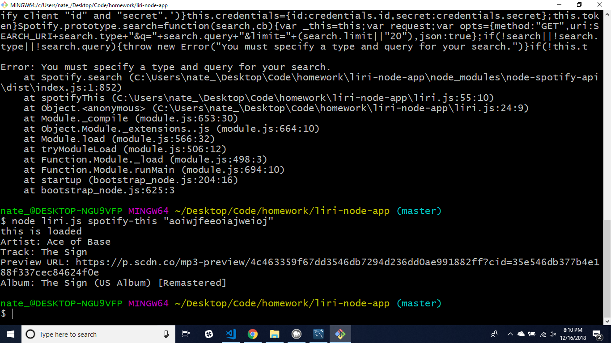

# liri-node-app

Concert-this being run.

The default movie being pulled up when the specified movie can't be found.

The default song pulled up when the specified song can't be found.

The movie specified by the movie-this call being displayed with details.

The song specified by the spotify-this call being displayed with details.

Pull the command from a text file to use the call in the app.

